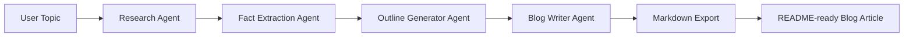
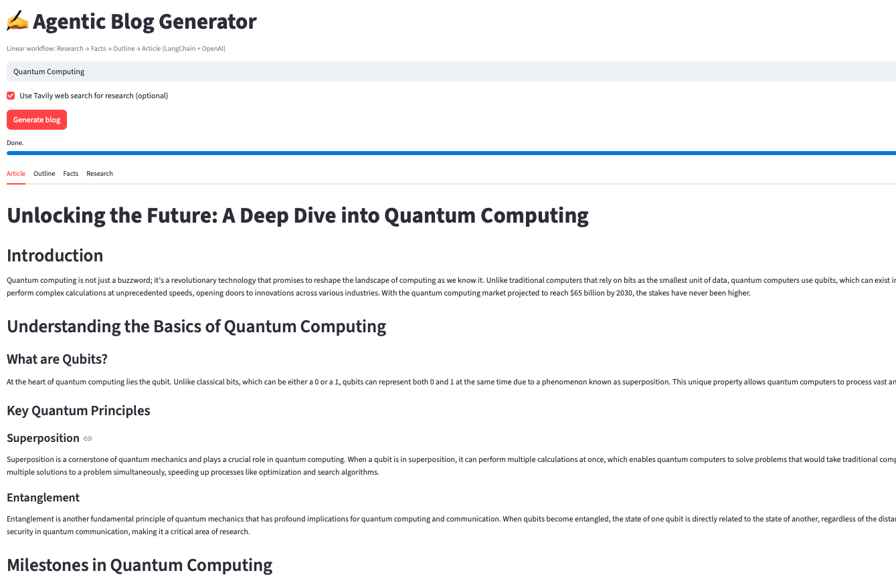
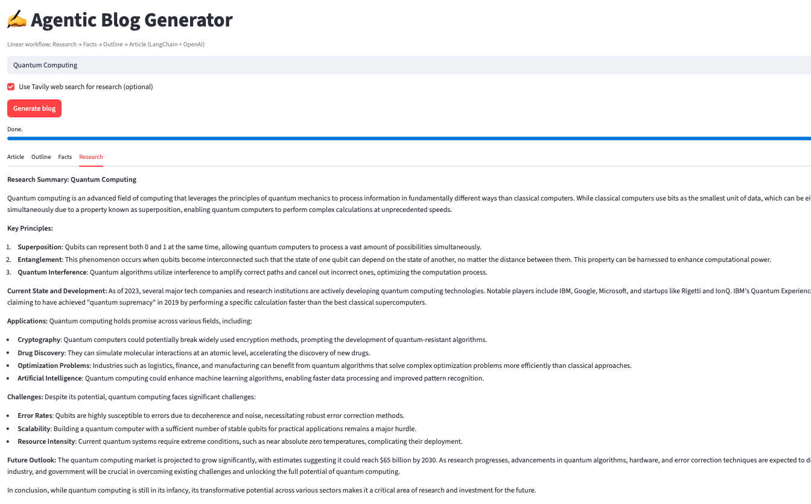
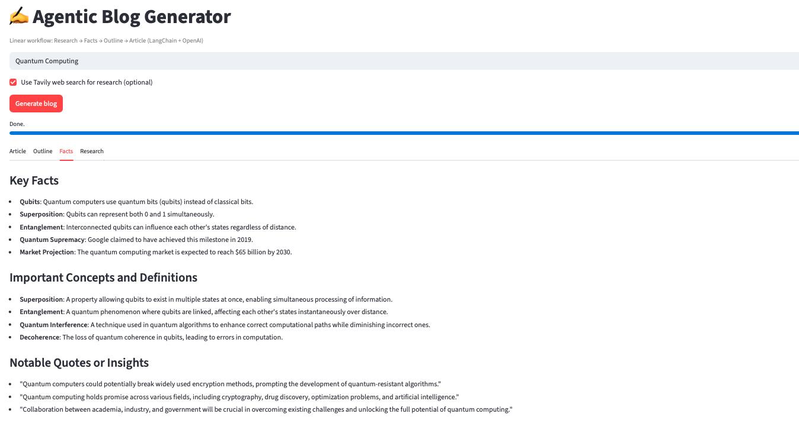
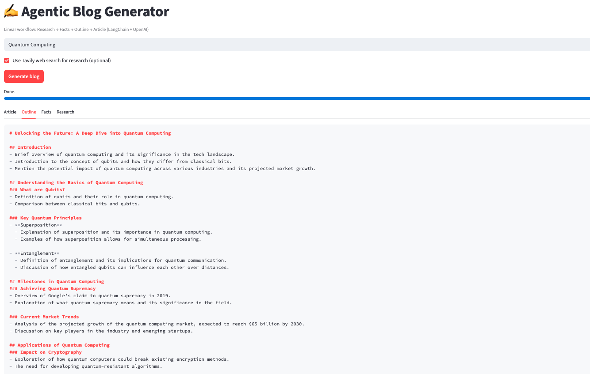

# Agentic AI Blog Generator (Linear Workflow with LangChain)

A simple **Agentic AI project demonstrating a linear workflow architecture** using **LangChain and OpenAI**.  
The system automatically researches a topic and generates a structured blog article.

This project is designed as an **educational starting point for Agentic AI architectures**, beginning with the **simplest form: a linear agent pipeline** before moving toward more advanced architectures.

---

## Project Overview

The **Blog Generator Agent** takes a topic as input and performs a sequence of AI-powered steps to create a blog post.

The workflow includes:

1. Researching the topic  
2. Extracting key facts  
3. Generating a structured outline  
4. Writing a full blog article  
5. Exporting the article as Markdown

This architecture demonstrates how **multiple specialized agents collaborate in a simple sequential pipeline**.

---

## Architecture

This project uses a **Linear Agentic Workflow**.



Each agent performs **one specialized task** and passes the result to the next step.

### Why a Linear Workflow?

Linear workflows are the **simplest and most reliable agentic architecture**.

Characteristics:

- Sequential execution
- Deterministic order
- Predictable outputs
- Easy debugging
- Minimal orchestration

This makes them ideal for **learning agentic AI system design**.

---

## Tech Stack

- Python
- LangChain
- OpenAI API
- Tavily / Search API (optional)
- Markdown export

---

## Agent Responsibilities

### Research Agent

Searches the web and gathers raw information about the topic.

### Fact Extraction Agent

Filters research results and extracts **important insights and concepts**.

### Outline Generator Agent

Creates a **structured blog outline**.

### Blog Writer Agent

Expands the outline into a **complete blog article**.

---

## Running the Project

### 1. Install dependencies

**Option A — virtual environment (recommended):**

```bash
python3 -m venv .venv
.venv/bin/pip install -r requirements.txt
```

**Option B — global install:**

```bash
pip install -r requirements.txt
```

### 2. Set environment variables

```bash
export OPENAI_API_KEY=your_api_key
```

### 3. Run the agent pipeline

**CLI:**

```bash
python main.py "Your blog topic here" -o examples/my_blog.md
```

**Streamlit demo:**

If you use the `.venv` from step 1:

```bash
.venv/bin/streamlit run app.py
```

Then enter a topic, click **Generate blog**, and view or download the article.

---

## Use Case

### Blog Writer Agent Output (Example)


---

### Research Agent Output (Example)


---

### Fact Extraction Agent Output (Example)


---

### Outline Generator Agent Output (Example)



